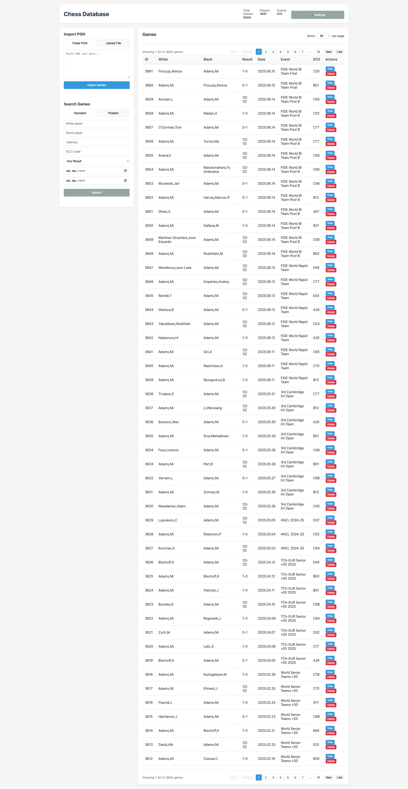
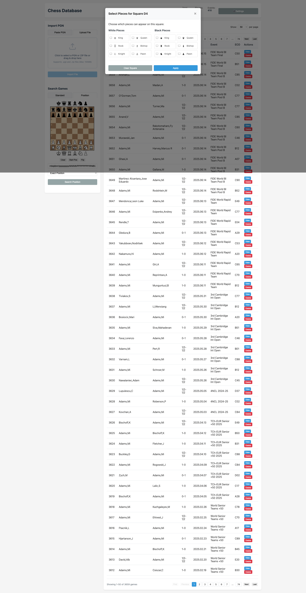
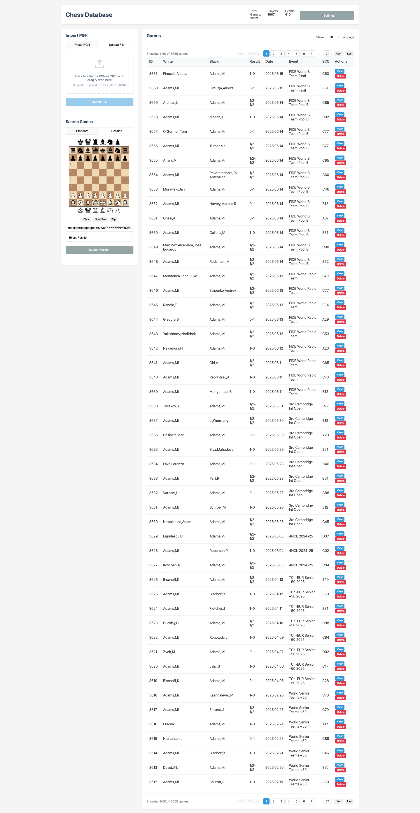
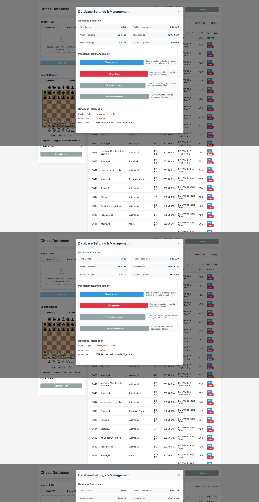
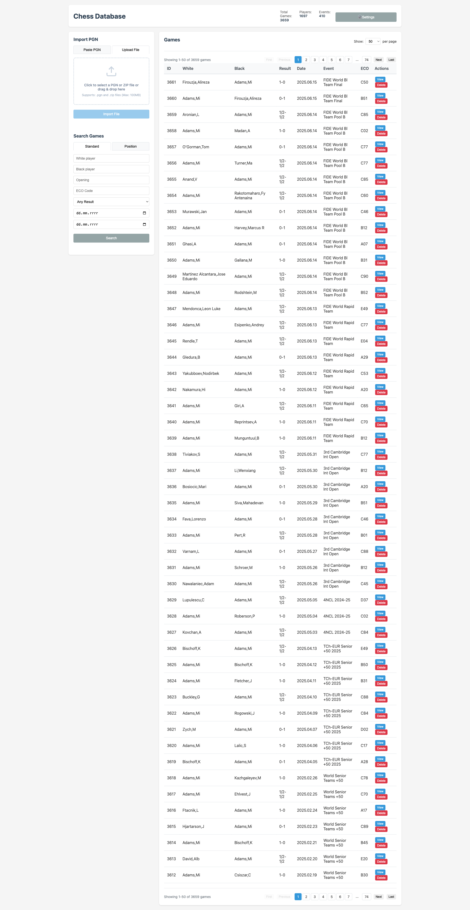

# ♟️ Chess Database Pro

> A comprehensive chess database application with advanced position search capabilities

> **⚠️ Early Development Notice**: This is a new project in active development (v0.1.x). Core functionality is working, but many features are still being implemented. Contributions and feedback are welcome!

[](https://nodejs.org/)
[](https://expressjs.com/)
[](https://sqlite.org/)
[](#testing--quality-assurance)
[](#quick-start)
[](https://claude.ai)
[](LICENSE)

Chess Database Pro is a comprehensive chess game management and analysis tool that allows you to import, search, and analyze chess games with sophisticated position-based queries. Built with modern web technologies, it provides professional chess database functionality directly in your browser.

---

## 🌟 Key Features

### 📊 **Comprehensive Game Management**
- **PGN Import**: Support for single games, multi-game PGN files, and ZIP archives
- **Drag & Drop**: Intuitive file upload with visual feedback
- **Bulk Processing**: Handle large databases with thousands of games
- **Real-time Statistics**: Live database metrics and performance monitoring


*Clean, professional interface with comprehensive game statistics*

### 🔍 **Advanced Position Search**
- **Pattern Matching**: Search for specific piece arrangements and tactical motifs
- **Multi-Piece Logic**: OR conditions (e.g., "Pawn OR Knight on d4")
- **Material Signatures**: Find positions with identical material balance
- **Exact Position**: Locate precise board positions across your database


*Interactive chess board for setting up position search patterns*

### ⚡ **Intelligent Multi-Piece Selection**
Advanced functionality that allows multiple piece types on a single square:


*Right-click any square to select multiple piece types with intuitive modal interface*

**Key Benefits:**
- **OR Logic**: Search where d4 can be "Pawn OR Knight OR Bishop"
- **Color Flexibility**: Include both white and black pieces in patterns
- **Visual Indicators**: Lightning bolt icons show multi-piece squares
- **Verified Logic**: Comprehensive test coverage ensures accuracy

### 📈 **Real-Time Search Progress**
No more waiting in the dark - see exactly what's happening:


*Live progress updates with streaming search technology and cancellation support*

- **Streaming Architecture**: Server-Sent Events for real-time updates
- **Progress Visualization**: Visual progress bars and percentage completion
- **Cancellation Support**: Stop long-running searches instantly
- **Batch Processing**: Optimized algorithms for large datasets

### ⚙️ **Database Management**
Professional-grade database administration tools:


*Comprehensive database management and statistics dashboard*

- **Index Management**: Rebuild, optimize, and maintain search indexes
- **Performance Metrics**: Detailed statistics on positions, games, and players
- **Database Health**: Monitor and fix database integrity issues
- **Storage Optimization**: Automatic cleanup and space management

---

## 🚀 Quick Start

### Prerequisites
- **Node.js** 18+ 
- **npm** or **yarn**
- Modern web browser (Chrome, Firefox, Safari, Edge)

### Installation

1. **Clone the repository**
   ```bash
   git clone https://github.com/yourusername/chess-database-pro.git
   cd chess-database-pro
   ```

2. **Install dependencies**
   ```bash
   npm install
   ```

3. **Start the server**
   ```bash
   npm start
   ```

4. **Open your browser**
   ```
   http://localhost:3000
   ```

### 🎮 Interactive Demo

Try the features immediately with our interactive demo:

```bash
# Run the interactive demo
npm run demo
```

This will show you:
- ✅ **Database statistics** and performance metrics
- ✅ **Exact position search** for starting positions
- ✅ **Pattern search** with single pieces
- ✅ **Multi-piece OR logic** functionality
- ✅ **Complex patterns** across multiple squares
- ✅ **Material signature** matching

### First Steps

1. **Import Games**: Use the file upload or paste PGN text
2. **Build Index**: Let the system automatically index all positions
3. **Search**: Set up pieces on the board and start searching!


*Drag & drop interface supporting PGN files and ZIP archives*

---

## 🔧 Advanced Usage

### Position Search Types

#### 1. **Exact Position Search**
Find games with identical board positions:
```javascript
// Searches for exact position match
searchType: "exact"
```

#### 2. **Pattern Search** 
Most flexible search method supporting:
- Single piece requirements: "White pawn on d4"
- Multi-piece OR logic: "Pawn OR Knight on d4"
- Complex patterns: Multiple constraint combinations

```javascript
// Pattern with OR logic
fen: "8/8/8/8/3[P|N]4/8/8/8 w - - 0 1"
searchType: "pattern"
```

#### 3. **Material Signature**
Find positions with identical piece counts:
```javascript
// Same material as starting position
searchType: "material"
```

### Multi-Piece Pattern Syntax

The bracket notation allows advanced search functionality:

| Pattern | Description | Example Use Case |
|---------|-------------|------------------|
| `[P\|N]` | Pawn OR Knight | Central control studies |
| `[P\|p]` | White OR Black pawn | Pawn structure analysis |
| `[B\|Q\|R]` | Bishop OR Queen OR Rook | Long-range piece activity |
| `[K\|Q][P\|N]` | Multiple squares with OR logic | Complex tactical patterns |

### API Integration

#### REST Endpoints
```javascript
// Position search
POST /api/positions/search
{
  "fen": "8/8/8/8/3[P|N]4/8/8/8 w - - 0 1",
  "searchType": "pattern",
  "page": 1,
  "pageSize": 20
}

// Streaming search with progress
POST /api/positions/search/stream
// Returns Server-Sent Events stream

// Database statistics
GET /api/stats
GET /api/stats/detailed
```

---

## 🏗️ Architecture

### Backend Technologies
- **Express.js**: Fast, unopinionated web framework
- **SQLite**: Embedded database with advanced indexing
- **Chess.js**: Robust chess move validation and game logic
- **Multer**: File upload handling with multi-format support

### Frontend Technologies
- **Vanilla JavaScript**: No framework dependencies, maximum performance
- **Chessboard.js**: Interactive chess board visualization
- **CSS Grid/Flexbox**: Modern responsive layout
- **Server-Sent Events**: Real-time progress updates

### Database Schema
```sql
-- Optimized for performance with strategic indexing
CREATE TABLE games (
  id INTEGER PRIMARY KEY,
  white TEXT, black TEXT, result TEXT,
  event TEXT, date TEXT, eco TEXT,
  pgn TEXT, -- Full PGN for replay
  -- Additional metadata fields
);

CREATE TABLE positions (
  id INTEGER PRIMARY KEY,
  game_id INTEGER,
  fen TEXT,
  zobrist_hash TEXT,     -- Fast exact position lookup
  material_signature TEXT, -- Quick material balance search
  move_number INTEGER,
  -- Optimized indexes for sub-second search
);
```

---

## 🧪 Testing & Quality Assurance

### Comprehensive Test Suite
```bash
# Unit tests for pattern matching logic
npm run test:unit

# API integration tests
npm run test:api

# Screenshot generation for documentation
npm run screenshots
```

### Test Coverage
- **33/33 Unit Tests** passing for multi-piece OR logic
- **Mathematical Verification** of search algorithms
- **Performance Benchmarks** for large datasets
- **Cross-browser Compatibility** testing

```bash
# Example verification output
✅ White pawns on d4: 7,056 positions
✅ Black pawns on d4: 1,163 positions  
✅ OR condition [P|p]: 8,220 positions ≈ 7,056 + 1,163
```

---

## 📊 Performance

### Benchmarks
- **Index Building**: ~1,000 games/second
- **Exact Search**: Sub-millisecond response
- **Pattern Search**: <100ms for complex patterns
- **Database Size**: Supports 100,000+ games efficiently

### Optimization Features
- **Zobrist Hashing**: O(1) exact position lookup
- **Material Signatures**: Fast material-based filtering
- **Strategic Indexing**: Optimized for common search patterns
- **Streaming Architecture**: Non-blocking long-running operations

---

## 🤝 Contributing

We welcome contributions! Please see our [Contributing Guide](CONTRIBUTING.md) for details.

### Development Setup
```bash
# Install development dependencies
npm install --include=dev

# Run development server with auto-reload
npm run dev

# Run test suite
npm test

# Generate documentation screenshots
npm run screenshots
```

### Key Areas for Contribution
- **Additional Search Patterns**: New pattern matching algorithms
- **Performance Optimization**: Database and search improvements
- **UI/UX Enhancements**: Better user experience and visualization
- **Mobile Support**: Responsive design improvements

---

## 📝 License

This project is licensed under the MIT License - see the [LICENSE](LICENSE) file for details.

---

## 🆘 Support

### Documentation
- **[User Guide](docs/user-guide.md)**: Comprehensive usage instructions
- **[API Reference](docs/api-reference.md)**: Complete API documentation
- **[Development Guide](docs/development.md)**: Setup and architecture details

### Community
- **Issues**: [GitHub Issues](https://github.com/yourusername/chess-database-pro/issues)
- **Discussions**: [GitHub Discussions](https://github.com/yourusername/chess-database-pro/discussions)
- **Email**: support@chess-database-pro.com

---

## 🙏 Acknowledgments

- **[Chess.js](https://github.com/jhlywa/chess.js)**: Excellent chess logic library
- **[Chessboard.js](https://chessboardjs.com/)**: Beautiful chess board visualization
- **Commercial Chess Software**: Inspiration for advanced position search
- **Chess Community**: Feedback and feature requests

---

## 🔮 Roadmap

> **📋 [Complete Feature Roadmap](docs/features-roadmap.md)**: Detailed breakdown of all planned features

### Phase 1: Essential Features (v0.2.x)
- [ ] **Interactive Game Viewer**: Move-by-move replay with annotations
- [ ] **Advanced Game Search**: Filter by ELO, date, opening, events
- [ ] **Game Collections**: Organize games into folders and tags
- [ ] **Move Annotations**: Display comments, variations, and symbols

### Phase 2: Professional Features (v0.3.x)
- [ ] **Opening Tree Explorer**: Move statistics and win rates
- [ ] **Advanced Position Search**: Pawn structures and tactical patterns
- [ ] **Player Statistics**: Head-to-head records and performance tracking
- [ ] **Tournament Reports**: Cross-tables and analysis

### Phase 3: Analysis & Training (v0.4.x)
- [ ] **Engine Integration**: Stockfish analysis and evaluation
- [ ] **Training Modules**: Tactical puzzles and position training
- [ ] **Import Enhancements**: Lichess, Chess.com game import
- [ ] **Automated Analysis**: Blunder detection and game insights

### Phase 4: Advanced Tools (v0.5.x)
- [ ] **Tournament Management**: Swiss pairing and live tournaments
- [ ] **Collaboration Features**: Multi-user databases and sharing
- [ ] **Mobile Applications**: iOS and Android apps
- [ ] **Advanced Analytics**: Playing style analysis

### Current Version (v0.1.x) ✅
- [x] **Core Database**: PGN import, SQLite storage, bulk processing
- [x] **Position Search**: Multi-piece patterns, exact matching, streaming
- [x] **Web Interface**: Responsive design, drag-drop, progress tracking
- [x] **API & Testing**: REST endpoints, comprehensive test coverage

---

<div align="center">

**Built with ❤️ for the chess community**

[⭐ Star this project](https://github.com/yourusername/chess-database-pro) | [🐛 Report Bug](https://github.com/yourusername/chess-database-pro/issues) | [✨ Request Feature](https://github.com/yourusername/chess-database-pro/issues)

</div>